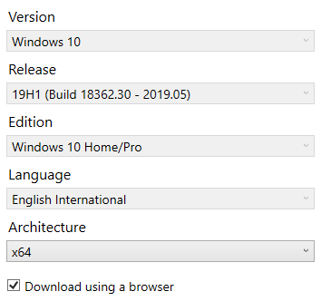
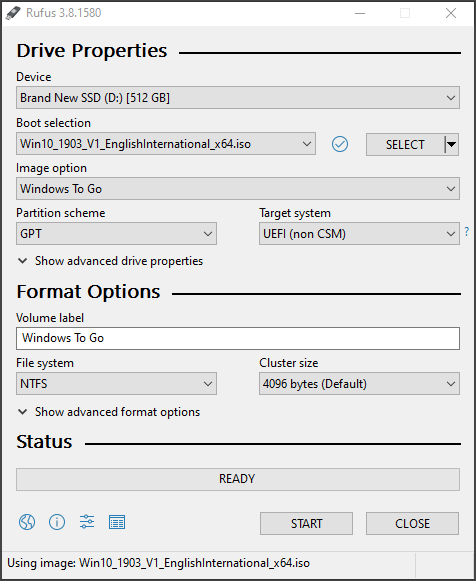
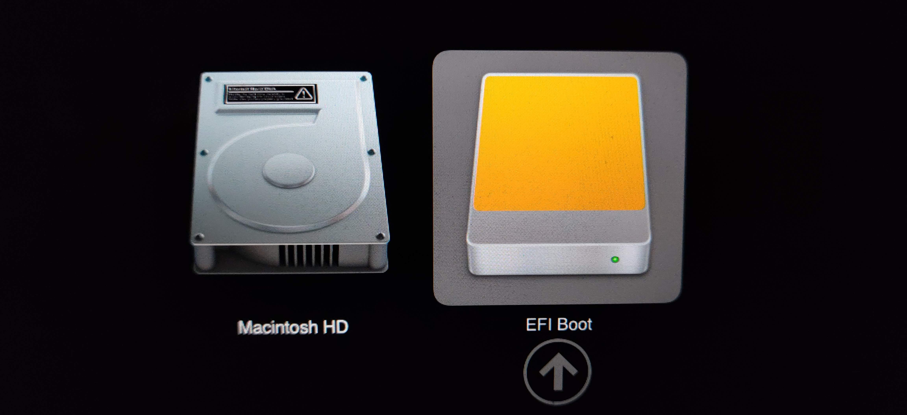

# Windows To Go

A few important notes, before we begin:

- It's CRITICALLY important that you own an external SSD that exceeds 400MB/s read/write speed.
    - I recommend the [SanDisk Extreme Portable SSD](https://smile.amazon.com/dp/B078SVRH4B/ref=twister_B078VKLF4L?_encoding=UTF8&psc=1) (~$75 as of this writing). It's USB-C, but also has an adapter.
    - This will use the whole drive. If you want to partition the drive and use it for multiple things then you're looking for a more advanced setup process.
- You will need an `exFAT` formatted thumb drive to use as a sneaker net.
- You will need two physical USB ports on your Mac. One of which will be used by the SSD, another which will be used by the thumb drive. Dongles may work in a pinch, but also maybe they won't.
- You'll need to borrow a Windows machine to run Rufus.
- You may also require a USB hub for your Mac. The first time you run Windows the proper drivers won't be installed yet. There's a chance your keyboard and/or mouse may not work until we install the proper drivers.

## Here we go!

### Use Bootcamp on your Mac to get drivers specific to your model of Mac

- Open Bootcamp. Do ***NOT*** go through the Bootcamp setup process. We just want the drivers then we're done with Mac for this year.
- In the system menu for Bootcamp, click on ***Download Windows Support Software***. Download the ***WindowsSupport*** drivers to a recognizable folder like Desktop

    

    While the download completes, you can begin the next 2 steps on a Windows machine.

- Once you have the ***WindowsSupport*** drivers, copy them to the `exFAT` thumb drive.
- Shut down your Mac completely.

### Download Rufus onto a Windows machine

[Rufus](https://rufus.ie/) - This process was tested with version 3.8

### Use Rufus to create a Windows To Go bootable SSD

1. In the dropdown menu next to the **SELECT** button, select **DOWNLOAD**, and then click the **DOWNLOAD** button.
1. Ensure that the selected version is ***Windows 10*** and continue.
1. which build works?
1. which edition?
1. Select your chosen language and continue.
1. Select the architecture ***x64***
1. Check the box next to ***Download using a browser***. Using the browser's built-in Downloads page allows for better control over downloading the nearly 5 GB file.

    When you get to the screen below, and all options match the screenshot below, then click ***Download***.

8. Once the download completes, in the dropdown menu next to the **DOWNLOAD** button, select **SELECT**, and then click the **SELECT** button.
1. Select and Open your Disc Image File that you just downloaded.
1. Select the image option ***Windows To Go***
1. Ensure the selected partition scheme is ***GPT***

    Note: Macbook models older than 2015 may need MBR

1. Change the Volume label to something meaningful like ***Windows To Go***

Ensure that your selected options all match the screenshot below. You may or may not have a different value for Boot selection.

13. Press **START.**
1. Select the version ***Windows 10 Pro*** and click OK.

### ALL DATA ON YOUR DEVICE WILL NOW BE DELETED. Be sure this is OK.

Rufus will run for several minutes formatting your SSD and installing Windows To Go. There is no confirmation when it is done.

You should notice that your drive now has your more meaningful name like below. Click **CLOSE.**

### Boot from Windows To Go SSD on Mac

1. Unplug all USB cables from your Mac except the SSD that you just used with Rufus.
1. On your Mac, while holding the Option key, press the power button to boot your Mac
1. When you see the options on your screen like below, Select ***EFI Boot***

- You should soon see the blue Windows 10 logo and a spinning loading icon.
- You'll be walked through the normal Windows 10 setup process. This is your computer. Set it up however you like.

	This may or may not be where you discover you need that USB hub. Alternatively, if your mouse works then you should have access to the on-screen accessibility keyboard.

	Set a secure password. You could easily lose your SSD, and one benefit of Windows To Go is that **it can be plugged into any computer and be accessed by _anyone_**.

### ✨Welcome to Windows :sparkles:

- Once you've logged into your Windows desktop, copy the ***WindowsSupport*** drivers to your new Windows desktop.
- Inside the ***WindowsSupport*** folder, inside the ***Bootcamp*** folder, run the ***Setup*** file.
    - If (for some reason, you are unable to run the setup file) try:
        1. Open Command Prompt as Administrator.
        1. Execute the following command. It assumes you've copied the drivers to the C drive instead of the Desktop.
        1. `msiexec /i C:\WindowsSupport\BootCamp\Drivers\Apple\BootCamp.msi`
- Install dev tooling
- Purchase Windows 10 Pro license 💲 💲 💲

    The unregistered version of Windows will run indefinitely. Microsoft still wants you to use the OS. Certain customizations are not activated until you buy a license. After something like 90 days you'll have a permanent watermark on your screen telling you to activate Windows.

### A couple notes about your Windows To Go installation:

- You ***should*** be able to briefly unplug the SSD while Windows To Go is running. Everything will freeze in place until you plug the SSD in again.

    After 60 seconds of the SSD unplugged, Windows will crash :( and data loss may occur. Attempt this at your own risk.

- Windows To Go is not "officially" supported on a Mac, but regardless it seems to work pretty reliably.
- Shutting down your computer when you're done with Windows and want to unplug the SSD is highly advised. Otherwise, you may lose work.
- Please don't put your laptop in your bag with the SSD still plugged in. It could damage your computer and also puppies hate it.
- The cable that come with the drive is specially rated to be fast enough to support Windows To Go. If you lose it, only an equally high enough quality cable will work.
